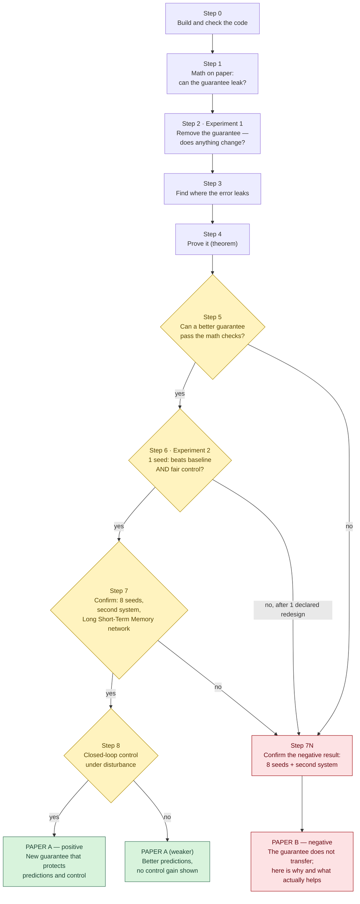

# Roadmap — Does Mamba's Stability Guarantee Make a Controller Safe?

**Owner:** Md. Adnan Abdullah Sadi · **Started:** 9 October 2026 · **Brief:** `README.md` · **Rules:** `CLAUDE.md` 

**In one line:** Mamba's internal memory is proven stable (the "locked dial"). We test whether that makes its *predictions* — the thing a controller uses — stable too (the "room temperature"). Either answer is a paper.

---

## The map

**Green** = positive paper · **Red** = negative paper · **Yellow** = decision points. Every path ends in a paper.

---

## Steps

Each step: what it asks, what the math predicts, what happens on pass or fail, and whether failure kills the project. Run times are estimates — update them after `tools/benchmark_device.py`.

### Step 0 — Build and check the code · ~1 week · no training
- **Do:** Van der Pol data; minimal cell, full Mamba block (~3,418 parameters), Long Short-Term Memory network (~3,052); `check_model.py`; `--quick` run.
- **Pass:** step-by-step and parallel outputs agree within 1e-4; every component gets gradient; parameter counts within 5% of Cevaal et al. → Step 1.
- **Fail:** fix the code. Nothing downstream is trustworthy until this passes.
- **Fatal?** No — engineering, not research.

### Step 1 — Math on paper · ~3 days · `analysis/a01`, `a02`
- **Do:** the 2×2 counterexample; largest singular value of the true Van der Pol Jacobian (how much one step magnifies a small error) along the limit cycle.
- **Math predicts:** eigenvalues of [[1, 1], [1, 0.5]] are 1.78 and −0.28 → guarantee holds, error still grows. Van der Pol magnifies errors above 1 on parts of the orbit → global contraction is impossible.
- **Pass:** both confirmed and written into `docs/math_notes.md` → Step 2.
- **Fail:** cannot fail on the algebra; if the orbit check surprises us, revise Step 5's design rules.
- **Fatal?** No.

### Step 2 — Experiment 1: remove the guarantee · ~1 hour (1 seed)
- **Arms:** guarantee on · decay allowed either sign · started unstable — each under teacher forcing and chained-prediction training, both prediction regimes.
- **Math predicts:** no difference after training (training keeps decay negative on its own).
- **Pass (any arm differs > 20%):** the guarantee does real work → confirm with 8 seeds. Feeds both papers.
- **Fail (all within 20%):** the guarantee is not what keeps predictions stable → core evidence for Paper B.
- **Fatal?** No. Either outcome is a finding.

### Step 3 — Find where the error leaks · ~2 days · no new training
- **Do:** on Step 2's trained models, measure error magnification over 50 steps through the *combined* state (prediction + hidden memory), block by block.
- **Pass:** one pathway dominates (first attempt pointed at the hidden memory) → Step 5 targets it.
- **Fail:** no single pathway → design target unclear; lean towards Paper B.
- **Fatal?** No.

### Step 4 — Prove it · ~2–3 weeks
- **4a:** real Mamba weights where the guarantee holds yet chained-prediction error grows geometrically. **Math predicts:** easy — the residual readout already puts a 1 on the diagonal.
- **4b:** extend Chung et al. (affine memory cannot correct drift) to continuous dynamics. **Math signal: INCONCLUSIVE** — under self-feeding, the input depends on the memory, so the joint map is *not* affine; their proof may not carry over directly.
- **Pass:** 4a + 4b → strong theory section for either paper.
- **Fail 4b:** keep 4a alone; still enough for Paper B.
- **Fatal?** Only if 4a fails — and that would itself mean the guarantee partly transfers (a surprising, publishable result).

### Step 5 — Design a better guarantee, on paper first · ~2 weeks
- **Candidates:** state-dependent correction inside the memory update (conditioned on input + memory, gate starting at 0.5) · bound on error magnification *relative* to the true system · transverse contraction (allows the limit cycle).
- **Every design must pass three checks:** (1) can still represent a limit cycle; (2) non-zero gradient at initialisation; (3) a provable bound on chained-prediction error.
- **Pass:** at least one design passes all three → Step 6.
- **Fail:** none passes → go to Step 7N. Do not spend compute on a design with a negative signal.
- **Fatal?** Ends the positive path only.

### Step 6 — Experiment 2: test the design · ~1 hour (1 seed)
- **Arms:** baseline · proposed · parameter-matched control (fixed, state-independent version) — each under both training methods.
- **Decision rule (fix in config before running):** 50-step error ≥ 20% lower than baseline **and** ≥ 10% lower than the control; one-step error no more than 10% worse; no divergence.
- **Pass:** → Step 7.
- **Fail:** one redesign allowed, declared in `docs/decisions.md` *before* rerunning. Fails again → Step 7N.
- **Fatal?** Ends the positive path only.
- **Honest note:** in the first attempt, chained-prediction training already removed most rollout error, leaving little room. A gain under teacher forcing only is the likeliest partial win — real, but weaker.

### Step 7 — Confirm the positive result · ~1–2 days of runs
- **Do:** 8 seeds; a second nonlinear system (for example a pendulum or stirred-tank reactor); same method on a Long Short-Term Memory network.
- **Pass:** Mann–Whitney p < 0.05 **and** |Cliff's delta| > 0.33 against baseline *and* control; limit cycle kept; zero divergence → Step 8.
- **Fail:** single-seed win was noise → Step 7N.
- **Fatal?** Ends the positive path only.

### Step 7N — Confirm the negative result · ~1 day of runs
- **Do:** 8 seeds of Step 2 + second system; show that chained-prediction training is what actually helps, for Mamba and the Long Short-Term Memory network alike.
- **Equivalence, not just "no significant difference":** declare a ±10% margin; the bootstrap 95% interval of (free-sign error ÷ guaranteed error) must sit inside 0.9–1.1.
- **Note:** CLAUDE.md's default ablation rule only confirms *differences*. Paper B needs a confirmed *null*, so add this equivalence rule to the exp01 config before running Step 2.
- **Pass:** → Paper B. **Fail:** results too noisy → more seeds, or report as inconclusive.

### Step 8 — Closed-loop control · ~3–4 weeks
- **Do:** model predictive control on Van der Pol — stabilise and track under disturbances and drift in μ; against unconstrained Mamba-based and Long Short-Term Memory-based controllers; both chained and direct multi-step predictors.
- **Pass:** better tracking or fewer failures at matched parameter count → Paper A.
- **Fail:** prediction gains do not reach the loop → Paper A (weaker), stated plainly.
- **Fatal?** No.

---

## Honest odds (my judgment, not evidence)

| Step | Likely outcome | Rough chance |
|---|---|---|
| 0, 1, 4a | Pass | > 90% |
| 2 | Guarantee makes no difference | ~75% |
| 4b | Clean extension of Chung et al. | ~35% |
| 5 + 6 | New design beats baseline **and** control under chained-prediction training | ~25% |
| **Final** | **Paper B (negative) is the most likely paper**, possibly with a partial teacher-forcing-only gain | — |

No single failure ends the project. The only true dead end is skipping Step 7N: a null result on one seed is not a paper.

## Rules that never change
1. Math signal first, recorded in the config's `math_signal` field.
2. One seed first; 8+ seeds only after the declared rule passes.
3. Decision rule written before the run. No tuning until it "looks good".
4. After each step: 2–3 lines in `docs/results_log.md`, including whether the math prediction held.
